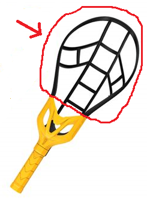

# Crackball Rulebook

# Introduction

I, Matthew Naeger, am not one of the creators of crackball.  One of the creators, Joe Hannan, taught it to me during my 
freshman year at Truman State University.  As far as I am aware, this document is the first attempt to formalize 
the rules of crackball, so I have had to add many details of my own because of imperfect memory and the fact that not all 
of the details necessary for a formal rulebook were decided upon back then.  

I cannot guarantee that the details I’ve added 
would be agreed upon by the creators, but I have tried to preserve the original rules and spirit of crackball, with 
only a few intentional changes.  For that reason, you can consider this a rulebook for Madison-style crackball, whereas the original is St. Louis-style crackball.  In the future, I intend to add a section to this document to outline the key differences between the two styles.

I have three main objectives in creating this document.  
1. I wish to offer people who have never played crackball a brief overview, just enough to start playing. I hope I've accomplished this with the [A Brief Explanation of How to Play](#a-brief-explanation-of-how-to-play) section.  
1. I wish to provide a reference that players cannot claim was made up on the spot to settle arguments on the field.  
1. I wish to be able to incorporate crackball into recreational sports leagues.

 - Matthew Naeger, Crackball Commissioner of Madison, WI

 June 8, 2023

# A Brief Explanation of How to Play
I recommend that people who have never played crackball read this section (or ask an experienced player to give an overview of the game) before playing.  You do not need to read any more than this section in order to start playing.  Indeed, later sections might be very confusing to people who have never played or watched a game of crackball.

Crackball is played on a rectangular field, using [lacrosse](https://en.wikipedia.org/wiki/Lacrosse) goals and 
[trac-ball](https://wham-o.com/products/game-time-trac-ball%C2%AE-classic) rackets, which are called crackets when used for crackball. It is often compared to lacrosse, mostly by people who have never played lacrosse, like me.

It is played with two teams, and the objective is to score points by getting the ball into the other team’s goal.  Players pass 
and shoot using their crackets; using hands and feet to catch or move the ball is illegal.  

Whenever you have the ball, you can run, pass, and shoot until a player on the other team tags you (or your cracket) with her 
cracket.  Once you are tagged, you can no longer run or shoot until you pass the ball, which you will have 5 seconds to do (someone 
on the other team must count out loud to enforce this).  After getting rid of the ball, you may run again until the next time you 
touch the ball and get tagged.  After you are tagged, defenders must remain an arm-plus-cracket distance away from you and cannot 
touch you or your cracket while you pass.

Once you touch the ball with your cracket, players on the other team may tag you even if you don’t yet have possession; you may still catch or pick up 
the ball (with your cracket) after this, but once you have possession, the rules of being tagged apply.  This rule is intended to 
prevent players from being able to circumvent tagging rules by bobbling the ball or passing it to themselves.

Players do not need to catch the ball when it is passed to them; if the ball hits the ground, players from either team may pick it up 
(with a cracket).

If the ball goes out of bounds, any player not on the team that touched it last (with cracket or body) may throw it back in bounds, 
ideally to a teammate.  

No forceful contact is permitted.  You may set a pick on another player (i.e., stand in his way), but you may not set a moving 
pick (i.e., match the movements of another player with the intention of blocking him without trying to get the ball yourself).

There are many more details to the Crackball Rulebook, but if you understand this section, then you know enough to start playing.

# Terminology
Throughout this document, players will be referred to as $B$, $B_1$, $B_2$, $Y$, $Y_1$, or $Y_2$ (standing for black and yellow, respectively, the two traditional [cracket](#cracket) colors) for ease of explanation.  Players $Y$, $Y_1$, and $Y_2$ are on team Yellow, and players $B$, $B_1$, and $B_2$ are on team Black.  All rules are symmetric between the two teams, i.e., even if a rule is stated as applying to $Y$, it also applies to $B$, and vice versa.

Throughout this document, shoes are considered part of the feet, gloves are considered part of the hand, and in general, any article of clothing is considered part of the body part it covers.  Even things that dangle from the body like hoods, scarves, shoestrings, and hair qualify as part of the body.  For example, if a rule says that a player may not move her foot from the ground, this rule really means that she may not move her shoe from the ground, assuming she is wearing a shoe.  

### Ball (or Crackball)
The ball (also known as the crackball) in a game of crackball is a plastic ball 3.5 inches in diameter.

### Cracket
A cracket is the tool used to catch, pick up, carry, and throw the ball in crackball.

### Handle

The handle is the part of the cracket that player's hold.

### Basket

The basket is the wide, webbed part of the cracket that is used to catch and throw the ball.

### Pocket

The pocket is the part of the cracket that the ball is typically carried in.

### Free Cracket
A free cracket is a cracket whose [handle](#handle) is not touching its owner's hand.  See [Free Crackets](#free-crackets).

### Possession

$Y$ has possession of the ball if all of the following are true:
* The ball is in the [pocket](#pocket) of $Y$'s cracket. 
* The ball is not moving relative to $Y$'s cracket pocket.
* $Y$'s cracket is not [free](#free-cracket).

### Covering

$B$ is covering the ball if all of the following are true:
* The ball is on the ground.
* $B$'s [basket](#basket) is above the ball, concave down.
* There is not enough room between $B$'s basket and the ground for another cracket to fit under $B$'s basket. 
* $B$'s cracket is not [free](#free-cracket).

### Releasing

If $Y$'s cracket is touching the ball, he releases the ball the instant his cracket is no longer touching the ball.

### Standing

$B$ is standing if either of her feet are on the ground and none of her other body parts are on the ground.

### Taggable Player

The taggable player is the player who may be tagged.  See [Which Player Is Taggable](#which-player-is-taggable) for when a player is taggable.

### Tagged Player

A player who was tagged while he was taggable is tagged until another player becomes taggable.  See [Tagging](#tagging) for details.

### Crackoff line

During a [crackoff](#crackoff), the crackoff line is a line 10 yards in front of the goal that the team that is [cracking off](#which-team-cracks-off) is defending.  See [Crackoff](#crackoff) and [Crackoff Diagram](#crackoff-diagram).

### Boundary lines
The lines marking the boundary of the field.  

### Out of Bounds
Any part of the ground on or beyond the [boundary lines](#boundary-lines) lines is considered out of bounds.

### Out-of-Bounds Point
The point where the ball was considered to be out of bounds and the reference point near which the [inbounding player](#inbounding-player) inbounds the ball.  See [Out of Bounds](#out-of-bounds-1).

# Field and Goal Dimensions

## Field Diagram

## Crackoff Diagram

## Goal Diagram

# Rules 

## Tagging

### Which Player Is Taggable
The player whose non-[free](#free-cracket) cracket most recently touched or [covered](#covering) the ball is the [taggable player](#taggable-player) and is the only taggable player.

### Which Players May Tag
 If $Y$ is [taggable](#which-player-is-taggable), then any player on team Black may tag $Y$.

### How to Tag
Whenever $Y$ is [taggable](#which-player-is-taggable), $B$ tags $Y$ by touching $Y$'s body or non-[free](#free-cracket) cracket with $B$’s non-[free](#free-cracket) cracket.  $Y$ then becomes the [tagged player](#tagged-player), and there is no [taggable player](#taggable-player) until another player meets the criteria in the [Which Player Is Taggable](#which-player-is-taggable) rule.
* $B$ may not intentionally physically harm $Y$ by tagging (or ever).  For example, $B$ may not purposely hit $Y$’s face or nether regions for a tag.  If the referee (or enough players on either team in a game with no referee) determines that $B$ intentionally harmed $Y$, the penalty is a [spot foul](#spot-foul) and (up to the referee's discretion) [expulsion](#expulsion) of $B$ from the game.

### Resetting the Tag

While $B_1$ is [tagged](#how-to-tag) or [taggable](#which-player-is-taggable), if $Y$ becomes taggable or $B_2$ becomes taggable, then $B_1$ is no longer tagged or taggable.

### Pivot Foot
Once $Y$ has stopped with [possession](#possession) of the ball while [tagged](#how-to-tag), he must establish a pivot foot, which cannot leave the ground or slide (only pivot) until he [releases](#releasing) the ball.

### Moving after Being Tagged
 When $Y$ is the [tagged player](#tagged-player) and has [possession](#possession) of the ball, if he was already running when being tagged, he must make an effort to stop as quickly as possible, but he will not be held in violation of the [Pivot Foot](#pivot-foot) rule if his momentum carries him farther without giving him an advantage.
* If there is no referee to enforce this rule, any player on the opposing team may determine if $Y$’s extra steps after being tagged gave him an advantage.  If $B$ determines this, she must announce it immediately.
  * In this case, $Y$ takes the ball back to the location at which he was tagged and had [possession](#possession), and play resumes as if $B$ had committed a [spot foul](#spot-foul) at the location.

### Time to Release the Ball after Being Tagged
 When $Y$ is [tagged](#tagged-player), [standing](#standing), and has [possession](#possession) of the ball, he has 5 seconds to [release](#release) the ball.  
* To enforce this rule, a player on team Black must count to 5 loudly and clearly enough for $Y$ to hear the count.  
  * This count must be done by a single player.  For example, if $B_1$ counts to 2 and then stops counting, $B_2$ may not resume the count at 3.  
  * This count must begin at 1 and proceed in numerical order (1, 2, 3, 4, 5), even if more than one second passed between when a player could have started counting and when he started counting.
  * It is traditional, but not required, to count by saying "stall 1... stall 2... stall 3... stall 4... stall 5."  
* If $Y$ has not yet released the ball when $B$ finishes saying “five” in the 5-second count, this is a [spot foul](#spot-foul) on  $Y$.

### Shooting after Being Tagged
If $Y$'s cracket touches the ball while he is the [tagged player](#tagged-player), and then ball goes into a goal while he is still the tagged player, then the goal is nullified by the tag.  
* Treat this as the ball going out of bounds, with the [out-of-bounds point](#out-of-bounds-point) on the [boundary line](#boundary-lines) closest to the point where the ball entered the goal.  
  * Note that the ball is not necessarily out on $Y$.  If the ball touches the body of $B$ (or the cracket of $B$ while the cracket isn’t touching $B$’s hand) before entering the goal, then it is out of bounds on $B$. See [Out of Bounds](#out-of-bounds-1) for more details. 

### Distance from a Tagged Player
If $B_1$ is [tagged](#tagged-player), stopped, and has [possession](#possession) of the ball, then $Y$’s entire body and cracket must remain at least one arm-plus-cracket distance from $B_1$’s body until $B_1$ [releases](#release) the ball.  In particular, $Y$ should not be close enough to touch $B_1$’s cracket when $B_1$ attempts to pass the ball.
* The arm-plus-cracket distance is measured by $B_1$'s arm and cracket.
* Exception: if $B_2$ is within one arm-plus-cracket distance of $B_1$, then $Y$ may also be arbitrarily close to $B_1$ (without touching him) while $B_2$ is close to $B_1$ and up to one second after $B_2$ ceases being close to $B_1.$  In particular, if $B_2$ runs past $B_1$, then $Y$ may follow.
* $Y$ does not need to remain one arm-plus-cracket distance from $B_1$'s arms and crackets, just from the rest of his body.  $Y$ should be far enough from $B_1$'s body that $B_1$'s cracket and arm will not hit $Y$ or $Y$'s cracket when $B_1$ attempts to pass the ball.

### Tagging an Arm or Cracket
 While $Y$ is [taggable](#taggable-player), $B$ may tag $Y$’s arm or cracket, which may inadvertently knock the ball out of $Y$’s [possession](#possession) or prevent $Y$ from gaining possession.  
* $B$ may not forcibly hit $Y$’s arm or cracket to knock the ball out of $Y$’s [possession](#possession) or prevent $Y$ from gaining [possession](#possession).
  * It is up to the judgment of the referee (or a player on either team when there is no referee) to determine whether a hit was forcible.

### A Tagged Player on the Ground
If $Y$ is [tagged](#tagged-player) and is in [possession](#possession) of the ball or is [covering](#covering) the ball, but he is not [standing](#standing), and the [5-second count](#time-to-release-the-ball-after-being-tagged) has not yet begun, then the [5-second count](#time-to-release-the-ball-after-being-tagged) begins when the first of following occurs:
* $Y$ has possession of the ball and is standing.
* $Y$ has possession of the ball and is making no effort to stand.
* $Y$ has possession of the ball and is looking away from the ball (e.g., for a place to pass it).
* $Y$ is covering the ball and making no attempt to obtain possession.
* $Y$ has been covering the ball for 5 seconds without obtaining possession (these 5 seconds do not need to be counted out loud).

### Consecutive Possessions while Tagged
If $B$ is [tagged](#tagged-player) and has [possession](#possession) of the ball, and then $B$ [releases](#release) the ball, then $B$ cannot touch the ball with her cracket again until the [tag is reset](#resetting-the-tag).

### Minimum Pass Distance
If $Y_1$ is [tagged](#tagged-player) and has [possession](#possession) of the ball, after $Y_1$ [releases](#release) the ball, it must be at least one arm-plus-cracket distance from $Y_1$’s cracket before touching $Y_2$’s cracket.
* The arm-plus-cracket distance is measured by $Y_1$'s arm and cracket.

### Touching without Tagging
$Y$ may touch $B$ with his cracket, even if $B$ is not [taggable](#taggable-player), but this will not make $B$ [tagged](#tagged-player) until/unless $B$ becomes taggable.

## Ball on the Ground

### Picking up the Ball

If the ball is on the ground, $B$ may pick it up with her cracket.  There is no stoppage of play for the ball hitting the ground.

### Covering the Ball
 If the ball is on the ground, $Y$ may [cover](#covering) it.
* After $Y$ begins covering, $Y$ is [taggable](#taggable-player), even if the ball did not touch the cracket.
* If $Y$ is [tagged](#how-to-tag) and is covering the ball, then $B$ must give $Y$ sufficient space to gain [possession](#possession) of the ball without uncovering it.  Specifically, $B$’s body and cracket must remain at least one cracket length from $Y$’s cracket.
  * If $Y$ ceases to cover the ball before obtaining possession (e.g., by turning over his cracket to attempt to scoop the ball), then $B$ may attempt to take the ball with her cracket or cover the ball with her cracket.

## Out of Bounds

### Ball out of Bounds
* If the ball touches the ground [out of bounds](#out-of-bounds), it is out on the player who most recently touched the ball (with cracket or body).
* In this case, the [out-of-bounds point](#out-of-bounds-point) is the point on the [boundary line](#boundary-lines) directly above which the ball last crossed before being ruled out of bounds.

### Player out of Bounds
* If a player (body or cracket) is touching the ground [out of bounds](#out-of-bounds) while touching the ball (with body or cracket), then the ball is considered out of bounds on that player.  
* If a player touches the ground out of bounds (with body or cracket) and then touches the ball (with body or cracket) before first touching the ground in bounds (with body or cracket), then the ball is considered out of bounds on that player.  
* In this case, the [out-of-bounds point](#out-of-bounds-point) is the point on the [boundary line](#boundary-lines) closest to the ball when it is ruled out of bounds.
* Players may move out of bounds except when forbidden by other rules (e.g., [Crackoff Line Rule](#crackoff-line-rule), [Non-inbounding Player Locations](#non-inbounding-player-locations)).

### Inbounding Player
After the ball goes [out of bounds](#out-of-bounds) on player $Y$, team Black passes the ball back in.
* Team Black may choose any player on its team to inbound the ball, i.e., to throw the ball in.

### Inbounding Player Location
Until [releasing](#releasing) the ball, the inbounding player must keep some body part (or cracket) within 3 yards of the [out-of-bounds point](#out-of-bounds-point).  
* No body part or cracket of the inbounding player may cross the [boundary line](#boundary-lines) until the ball is released.

### Inbounding Time
The inbounding player has 5 seconds to release the ball.
* The 5-second count begins when the inbounding player has [possession](#possession) and is in the [inbounding location](#inbounding-player-location).
* A player on the opposing team must make the 5-second count, and it must be loud enough for the inbounding player to hear it clearly, following the same 5-second count rules as in [Time to Release the Ball after Being Tagged](#time-to-release-the-ball-after-being-tagged).

### Non-Inbounding Player Locations
During the [inbounding time](#inbounding-time), all players (body and cracket) except the [inbounding player](#inbounding-player) must remain entirely in bounds without crossing the [boundary line](#boundary-lines) until the inbounding player [releases](#releasing) the ball.
* If $Y$ is the inbounding player, then $B$ may be as close as she wishes to $Y$, provided she does not cross the boundary line (with body or cracket).  The onus to create enough space to pass is on $Y$, who may move according to the [Inbounding Player Location](#inbounding-player-location) rule.

### After Inbounding
Once the [inbounding](#inbounding-player) player [releases](#releasing) the ball, play resumes as usual, but the inbounding player is considered [tagged](#tagged-player) until the [tag is reset](#resetting-the-tag).

## Scoring Goals

### How to Score
If the ball enters team Yellow’s goal while no player (on either team) is [tagged](#tagged-player), then team Black scores one point.  
* The ball is considered to enter the goal as soon as any part of the ball crosses the plane determined by the back of the goal posts, between the left and right goal posts and under the top goal post.

### After Scoring
 After team Black scores, if team Black has 6 points, then the game ends, and team Black wins.  Otherwise, teams switch sides of the field and goals to defend, and team Black [cracks off](#crackoff).

### Moving the Goal
 Moving the goal posts during play is a [spot foul](#spot-foul).  
* Players may touch the goal posts during play without moving them.
* Moving goal posts not during play is legal, provided the goal posts are moved back before play resumes.  For example, $B$ may carry the ball into team Yellow’s goal (while not tagged) and move the goal posts when doing so, provided the goal is scored before the goal posts move.

## Blocking

### Setting a Pick
$Y$ may stand in place in order to get in the way of $B$.
* $Y$’s feet may be no more than 1.5 times $Y$’s shoulder width apart when setting a pick.
* $Y$ may not extend his arms or cracket away from his body while setting a pick.

### Moving Picks
 If $Y$ is facing $B$, then $Y$ may not match $B$’s movements with the intention of blocking $B$.  
* $Y$ may inadvertently get in $B$’s way while moving and facing $B$ if $Y$ is clearly attempting to position himself to get the ball.

### Blocking out
 If $Y$ is facing away from $B$, then $Y$ may block out $B$, i.e., move with the intention of getting in $B$’s way.
* Forcible contact is not allowed. $Y$ may not attempt to push $B$ backwards in the process of blocking out.  Likewise, $B$ may not attempt to push $Y$ forward.

## Touching the Ball with a Body Part     

### Blocking Goals
 If the ball is moving toward team Yellow’s goal, then $Y$ may block it with his body or cracket.  
* In this situation, $Y$ may extend his arms or legs and use them to block the ball.
* In this situation ([as in any situation](#kicking-or-swatting-the-ball)), $Y$ may not swing his arms or legs to kick or swat the ball.

### Blocking Passes
If the ball is not moving toward team Yellow’s goal, then $Y$ may not intentionally touch it with a body part.  
* There is no penalty for $Y$ touching the ball with a body part if it is not $Y$’s fault, e.g., if $B$ throws the ball where $Y$ is already standing or moving, and $Y$ does not have sufficient time to adjust.  
* $Y$ may not extend his non-cracket arm (i.e., an arm that is not holding a cracket) to block $B$’s pass or shot before $B$ has [released](#release) the ball.

### Grabbing the Ball
While the ball is in play, no player may grab it.  Grabbing includes using hands, feet, armpits, or any other body part to hold the ball in place or carry it.

### Kicking or Swatting the Ball
Players may not kick or swat the ball with body parts.

### Using a Body Part to Aid in Catching
Players may not touch the ball with any body parts to aid in catching, securing the ball in the cracket, gaining [possession](#possession), or maintaining possession.

## Crackoff

### Crackoff Summary
At the beginning of a game or after a goal is scored, play begins or resumes by a player from one team throwing the ball.

### Which Team Cracks off
* At the beginning of the game, a coin toss is used to determine which team cracks off.  In an informal game, players may decide which team cracks off however they want.  

* After a [goal](#scoring-goals) is scored, the team that scored cracks off.

### Which Player Cracks off
The team that is cracking off may choose any of its players to crack off.

### Crackoff Line Rule
Before a crackoff, every player must be [in bounds](#out-of-bounds) on or behind her team’s [crackoff line](#crackoff-line), i.e., until the player who cracks off [releases](#releasing) the ball, every player must have some body part on her team’s [crackoff line](#crackoff-line) or behind it (i.e., on the side of the crackoff line containing the goal her team is defending).  
* Players may be in motion before the ball is released.

### Possession after Crackoff
When $B$ cracks off, she may throw the ball anywhere on the field or [out of bounds](#out-of-bounds).  
* If the ball remains in bounds, then players of team Black may not touch the ball (with cracket or body) until a player from team Yellow touches the ball (with cracket or body) or 30 seconds have elapsed from the time $B$  [released](#releasing) the ball.  
  * Until team Yellow touches the ball or 30 seconds have elapsed, team Black must also give team Yellow sufficient space (at least one cracket length from the ball) to [cover](#covering) the ball before it is first touched.  
  The 30 seconds do not need to be counted out loud.
* If the ball goes [out of bounds](#out-of-bounds), treat it as a usual [out-of-bounds situation](#ball-out-of-bounds).  
* If the ball goes in a goal, treat it as if $B$ had been [tagged](#tagged-player) before releasing] the ball.  

## Free Crackets

### Throwing a Cracket
Typically, player $Y$ may throw his cracket, e.g., he may throw a cracket with a ball in it into the goal or throw a cracket at a ball to block a shot.
* Exception: If $B$ is [taggable](#taggable-player), then $Y$ may not throw his cracket at $B$.  This is to prevent $B$ from thinking she was [tagged](#tagged-player) even when she wasn’t.
  * The penalty for throwing a cracket at [taggable player](#taggable-player)  is one minute in the [penalty box](#penalty-box).

### Handling a Free Cracket
If $Y$’s cracket is [free](#free-cracket), then any other player may hit $Y$’s cracket with her own cracket, but she may not grab or pick up $Y$’s cracket with any body part or cracket.  See [Trading Crackets](#trading-crackets) for an exception.
* Incidental bodily contact with $Y$’s free cracket is allowed, but no other player may swat or kick the free cracket with a body part.
* $Y$ may pick up, swat, kick, or otherwise touch his own free cracket with any part of his body.

## Penalties

### Spot Foul 
* The penalty for violating any rule that does not specify a penalty is a spot foul.
* If $Y$ commits a spot foul, then $B$ (any player on team Black) takes [possession](#possession) ball at the location of the spot foul, and play resumes as if $B$ is [tagged](#tagged-player).
* If $Y$ commits a spot foul, the referee (or team Black if there is no referee) may continue play if he immediately determines that doing so is in team Black’s best interest.

### Expulsion
If a referee (or a majority of players if there is no referree) agree that $B_1$ is intentionally physically endangering $Y$ or $B_2$, then she may expel $B_1$ from the game.

### Penalty Box
For certain fouls, player $Y$ may be forced to enter the penatly box for a certain amount of time.  This means that he exists the game without being replaced and may not return until the specified amount of game time has elapsed.  Team Yellow plays with one fewer player than usual during that time.

## Players and Substitions

### Number of Players in Play
Each team may have up to seven players in play at one time.  In an informal game, teams may agree to play with any number of players.

### Substitions
Team Black may substitute $B_1$ from the bench for $B_2$ from in play during any stoppage of play.
* $B_1$ or $B_2$ must declare the substition loudly and clearly enough for a referee (or a player from team Yellow if there is no referee) to hear before play resumes.  
* $B_2$'s entire body and cracket must be [out of bounds](#out-of-bounds) before any part of $B_1$'s body or cracket is in bounds.
* Stoppages of play include the time after [scoring goals](#scoring-goals), [out of bounds](#out-of-bounds-1), and [spot fouls](#spot-foul).

### Trading Crackets
During a stoppage of play, players may swap their crackets with each other or with crackets that are out of play.  

# Example Scenarios

There are many situations that can arise during a game of crackball that are not explicitly discussed in the rules but that may nevertheless be officiated by referring to the rules.  This section gives some examples.  

### Running Start at Crackoff
Any player may have a running start toward the [crackoff line](#crackoff-line), provided some part of his body remains on or behind the crackoff line until the ball is [released](#releasing), per the [Crackoff Line Rule](#crackoff-line-rule).

### Inbounding => Tagged
Because the [inbounding player](#inbounding-player) is considered [tagged](#tagged-player) after [releasing](#release) the ball (by the [After Inbounding](#after-inbounding) rule):
* If the ball goes into the goal without touching another player’s cracket, the goal is nullified by the tag (by the [Shooting after Being Tagged](#shooting-after-being-tagged) rule).
* If the inbounding player recovers the ball without anyone else’s cracket touching it first, she is still tagged.

### Tags While a Player Doesn’t Possess the Ball
If $B$ has the ball and is not [tagged](#tagged-player), and then $B$ [releases](#releasing) the ball, and then $Y$ [tags](#how-to-tag) $B$, and then $B$ picks up the ball, then $B$ is still [tagged](#tagged-player).  This follows from the [Which Player Is Taggable](#which-player-is-taggable) rule and the [Resetting the Tag](#resetting-the-tag) rule.

### Throwing the Ball into Your Own Goal While Tagged
If $Y$ has been [tagged](#how-to-tag) and his cracket is touching the ball, and then ball goes into team Yellow's goal while he is still tagged, then the goal is nullified, just as if $B$ had been tagged instead.  This follows from the [Shooting after Being Tagged](#shooting-after-being-tagged) rule, which doesn’t specify which goal the ball enters while $Y$ is tagged.

### Touching a Player before He Touches the Ball
Suppose $B_1$ passes the ball to $B_2$, and $Y$ has his cracket touching $B_2$, even before $B_2$ touches the ball ([Touching without Tagging](#touching-without-tagging) states that $Y$ may do this), and $B_2$ swings his cracket to shoot the ball, only touching the ball for an instant.  If $Y$’s cracket was still touching $B_2$ during that instant, then $B_2$ is [tagged](#how-to-tag) (because $B_2$ was [taggable](#taggable-player) according to [Which Player Is Taggable](#which-player-is-taggable)), and if the ball enters the goal, the goal is nullified (by [Shooting after Being Tagged](#shooting-after-being-tagged)).  

### Bouncing off a Cracket into the Goal
Suppose $Y_1$ is [tagged](#tagged-player) but decides to shoot the ball anyway.  If the ball hits the non-[free](#free-cracket) cracket of $B$ or of $Y_2$ before entering the goal, then the [tag is reset](#resetting-the-tag) whenever hitting the cracket, so the [Shooting after Being Tagged](#shooting-after-being-tagged) rule no longer applies (assuming $B$ or $Y_2$ was not tagged upon becoming [taggable](#which-player-is-taggable)), and the goal counts.

# Variations 

Sometimes we play with unofficial rules, fields, or equipment.  Here are some rules that can be used in those situations.

## Different Number of Players
Teams may agree to play with a number of players other than seven.  The [Half-Field](#half-field) variant may be useful when you have few players.

## Cones for Out-of-Bounds Lines

### Connect the Dots
If using cones instead of lines to mark field boundaries, treat cones as [out of bounds](#out-of-bounds) (i.e., if a ball or body part touches a cone, it is out of bounds), and between cones, treat the line segment connecting the center of the base of adjacent cones to be the [boundary line](#boundary-lines).

## Different Win Conditions

### Different Number of Points
Before (or during) the game, both teams may agree to play to a score other than 6.  

### Time limit
Before (or during) the game, both teams may agree to play for a certain amount of time instead of to a certain number of points.

## Different Size Field
Instead of using a [standard field size](#field-diagram), teams may agree on whatever size they want for the field.  

In pick-up games (the only kind I've played), we've never actually measured the field before playing a game, and I suspect we typically play with a significantly smaller field than the "standard" size.

## Goalies
Teams may agree to play with goalies.  Team Yellow's goalie will be denoted $Y_G,$ and team Black's goalie will be denoted $B_G.$

### Caution
The ball is often shot quite hard at the goal.  It is advised for the goalies to wear extra protection, especially to cover their faces.

### Goalie Crackets
Instead of standard [crackets](#cracket), goalies use special goalie crackets, which are [Nerf foam tennis rackets](https://www.walmart.com/ip/Nerf-Foam-Tennis-Set-for-Kids-2-Player-Kids-Tennis-Set-Jumbo-Rackets-and-Foam-Tennis-Ball/842570295).  Normal tennis rackets or anything that's shaped somewhat like a tennis racket probably would work too, but the advantage of the foam tennis rackets over normal tennis rackets is that the foam ones can [cover](#covering) the ball better, and goalies often cover the ball while waiting for a teammate to pick it up.

### Goalies and Resetting Tags
Goalies are an exception to [Resetting the Tag](#resetting-the-tag): If $B$ is [tagged](#tagged-player), and $Y_G$ becomes [taggable](#which-player-is-taggable), then $B$ is still tagged until a non-goalie player becomes taggable.
* The purpose of this rule is to prevent players from shooting while tagged in the hopes of bouncing the ball off of the goalie's cracket and into the goal.
* If $B$ is taggable but not tagged, then $Y_G$ becoming taggable [resets the tag](#resetting-the-tag) as usual, i.e., $B$ is no longer taggable.

## Half Field
The half-field variant is helpful in the following situations (and probably other situations):
* You have few players.
* You have only one goal.
* Players don't want to run as much as usual.
* Only one person wants to be a goalie.

This variant is similar to half-court basketball.  There is only one goal, and the team that can score in it is the team that most recently had [possession](#possession) behind the [back line](#back-line).  Read below for details.

### Back Line
The back line is a line parallel to the [crackoff line](#crackoff-line) and on the other side of the crackoff line than the goal.

### Score-Eligible Team
The score-eligible team is the team that most recently had a player with [possession](#possession) of the ball behind the [back line](#back-line) (i.e., on the opposite side of the back line than the goal).
* The entire ball must be behind the back line while in possession.  Whether the body of the player is behind the back line is irrelevant.
* An [inbounding player](#inbounding-player) is considered to have possession for this rule.  For example, if team Black is score eligible and the ball goes [out of bounds](#out-of-bounds-1) on $B$, and if $Y$ possesses the ball behind the back line before inbounding it (while moving subject to the [Inbounding Player Location](#inbounding-player-location) rule), then team Yellow is score eligible even if $Y$ passes to a player who is not behind the back line.
* If neither team has had a player with possession behind the back line since the most recent goal was scored, then the score-eligible team is the team that did not crack off most recently.

If a goal is scored (subject to the usual rules of [Scoring Goals](#scoring-goals)), then the score-eligible team is the team that receives a point.

### Half-Field Boundaries
The [boundary lines](#boundary-lines) on the sides of the field (perpendicular to the crackoff line) extend beyond the [back line](#back-line).

Teams may agree to have a boundary line parallel to the crackoff line behind the back line, or they may agree that the field extends indefinitely in that direction.

### Shared Goalie
Teams may choose to play the half-field variant with a [goalie](#goalies).  The goalie is always playing for whichever team that is not [score eligible](#score-eligible-team).